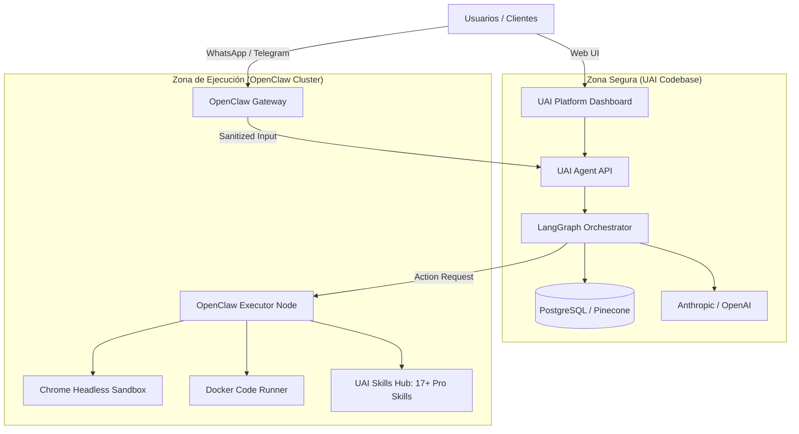

# Arquitectura de Integración: Cerebro Central (UAI) + Tentáculos Seguros (OpenClaw)

## 1. Visión Estratégica
El objetivo de esta arquitectura es **desacoplar el núcleo de inteligencia (UAI Platform)** de las interfaces de entrada/salida y ejecución de riesgo (OpenClaw), creando un sistema distribuido y seguro.

- **UAI Platform (Cerebro):** Orquestación, Razonamiento Profundo (Claude/GPT), Memoria a Largo Plazo (PostgreSQL/Pinecone), Gestión de Usuarios y Pagos.
- **OpenClaw (Tentáculos):** Interacción con el Mundo Real, Navegación Web, Chat Bots (WhatsApp/Telegram), Ejecución de Código en Sandbox.

---

## 2. Diagrama de Flujo de Datos

---

## 3. El "UAI Skills Hub" (La Diferencia Técnico-Estratégica) No es solo teoría; es un arsenal operativo.
A diferencia de otras plataformas, UAI integra un arsenal de herramientas procedimentales (skills) que los agentes invocan para no ser genéricos.

### Categorías de Skills Activos:
1. **Negocio & Estrategia:** Pricing Psychology, GTM Launch, Content Authority.
2. **Ingeniería de Datos:** Database Schema Architect, RAG Optimizer (Pinecone).
3. **Optimización de Producto:** UX/UI Pro Max, Marketing Psychology Audit.
4. **Seguridad y MCP:** Security Hardening, MCP Connector Builder.

---

## 3. Componentes y Responsabilidades

### A. UAI Platform (Core - El Cerebro)
*   **Responsabilidad:** Tomar decisiones, mantener el contexto de la misión, gestionar la identidad del usuario y cobrar por el uso.
*   **Seguridad:** Zero Trust. No confía en los inputs crudos de los "Tentáculos".
*   **Interacción:** Expone una API segura (`POST /api/agent/remote-execute`) protegida por API Key maestra.

### B. OpenClaw (Edge - Los Tentáculos)
*   **Responsabilidad:** 
    1.  **Ingesta Omnicanal:** Recibir mensajes de WhatsApp, Telegram, Slack, etc.
    2.  **Ejecución de Riesgo:** Correr scripts de Python generados por la IA en contenedores efímeros.
    3.  **Navegación:** Usar Chrome para leer webs, hacer screenshots o interactuar con sitios complejos.
*   **Seguridad:** 
    *   Se ejecuta en instancias aisladas (Railay Services separados o VPS dedicados).
    *   No tiene acceso directo a la base de datos de UAI.
    *   Solo se comunica con UAI a través de la API definida.

---

## 4. Flujo de Trabajo: Misión Omnicanal (Ejemplo)

1.  **Inicio:** Un usuario envía un audio por **WhatsApp** a su número de asistente.
2.  **Recepción:** **OpenClaw (Gateway)** recibe el audio, lo transcribe (whisper local o API) y extrae el texto.
3.  **Consulta al Cerebro:** OpenClaw envía un `POST` a `UAI Platform`: 
    *   `payload: { user_id: "whatsapp_123", input: "Analiza el mercado de criptos hoy", source: "whatsapp" }`
4.  **Razonamiento:** **UAI Orchestrator** (Claude 3.5) analiza la petición, recupera memoria del usuario y decide que necesita **navegar en tiempo real**.
5.  **Acción Remota:** UAI envía una instrucción de vuelta a OpenClaw:
    *   `action: "browser.browse", params: { url: "https://coinmarketcap.com" }`
6.  **Ejecución:** **OpenClaw (Executor)** lanza un navegador headless, lee la web, y devuelve el resumen a UAI.
7.  **Respuesta:** UAI genera la respuesta final y la envía a OpenClaw.
8.  **Entrega:** OpenClaw envía el texto (o un audio generado) al usuario por WhatsApp.

---

## 5. Ventajas de Seguridad (Seguridad por Diseño)

1.  **Aislamiento de Fallos:** Si un script malicioso o una web infectada compromete al navegador de OpenClaw, **solo cae el nodo ejecutor**, no la base de datos de usuarios ni las claves de Stripe de UAI Platform.
2.  **Protección de IP y Secretos:** Las claves de API de Anthropic/OpenAI viven en el núcleo seguro. Los tokens de sesión de WhatsApp viven en el borde.
3.  **Escalabilidad Horizontal:** Puedes tener 1 Cerebro y 50 Nodos OpenClaw distribuidos geográficamente para menor latencia en navegación.

---

## 6. Próximos Pasos para Implementación

1.  **Fase 1 (Piloto):** 
    *   Desplegar una instancia de OpenClaw en Railway (Docker Image).
    *   Configurarla con un "Custom Model" que apunte a la API de UAI.
    *   Probar la integración con Telegram (más fácil y segura que WhatsApp API).

2.  **Fase 2 (Tools Remotas):**
    *   Modificar `nodes.ts` en UAI para que el `ExecutorNode` sepa delegar tareas de navegación a la API de OpenClaw.

3.  **Fase 3 (Producción):**
    *   Implementar autenticación robusta (JWT/HMAC) entre UAI y los nodos OpenClaw.
